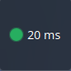
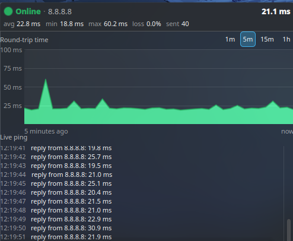
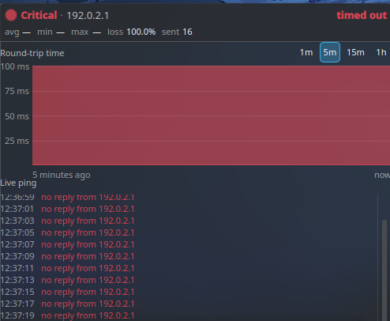

# Pingacik

A KDE Plasma 6 panel widget that monitors internet connection quality by pinging a host.

The panel shows a traffic-light dot and the current round-trip time. Click it for a live ping log
and an RTT chart over a configurable timescale.

<p align="center">
  
</p>

<p align="center">
  
  &nbsp;
  
</p>

## Install

```sh
git clone https://github.com/smolamSK/pingacik.git
cd pingacik
./install.sh
```

Then right-click your panel → **Add or Manage Widgets…** → **Pingacik**.

Requires Plasma 6 and `ping` (iputils). It is a pure QML applet — nothing to compile.

To remove it:

```sh
kpackagetool6 --type Plasma/Applet --remove org.smolam.pingacik
```

## How the colours work

The widget sends one `ping -c 1` per interval and feeds each result into a hysteresis state machine.

**It degrades immediately but recovers slowly.** Crossing a threshold changes the colour on the very
next sample; returning to green requires `recoverAfter` consecutive good pings. A "good" ping got a
reply *and* came back faster than the yellow latency threshold.

| Trigger | Default |
|---|---|
| Yellow after N consecutive lost pings | 2 |
| Red after N consecutive lost pings | 5 |
| Yellow above | 150 ms |
| Red above | 500 ms |
| Back to green after N consecutive good pings | 5 |

Packet loss and latency are evaluated separately and the worse of the two wins, so a link that
delivers every packet but takes 800 ms still shows red. A single lost or slow ping never changes the
colour — losses must be *consecutive*, and any reply resets the loss count.

Latency reuses the same consecutive counts as packet loss rather than adding separate knobs, so one
RTT spike is ignored while a sustained slowdown ramps yellow → red.

## Settings

Right-click the widget → **Configure Pingacik…**

**General** — target host (default `8.8.8.8`), ping interval, reply timeout, whether to show the
latency text in the panel, and the chart range the popup opens with.

**Thresholds** — everything in the table above.

Changing the host, interval or timeout clears the collected history, since it is no longer
comparable.

## Notes

- History is kept in memory only — roughly the last hour at the default 1 s interval. It resets when
  the widget or plasmashell restarts. Nothing is written to disk.
- The chart downsamples to ~300 buckets, so the 1 h view stays responsive. Buckets containing lost
  packets are shaded red in proportion to how many were lost.
- If a ping has not returned by the time the next tick fires, that tick is skipped rather than
  queued, so a stalled link cannot pile up processes. This is why the reply timeout defaults to the
  same value as the interval: a longer timeout thins out the sample rate precisely while the
  connection is failing.
- Thresholds are counted in pings, not seconds. During an outage each lost ping costs a full timeout
  before it registers, so samples arrive roughly every 2 s rather than every 1 s while the link is
  down — "red after 5 lost pings" is about 10 s of wall clock at the defaults.
- Dropped on the desktop rather than a panel, the widget shows the full view directly.

## Development

```sh
node tools/test-pingstate.js                          # logic tests
plasmoidviewer -a org.smolam.pingacik -f planar       # full view
plasmoidviewer -a org.smolam.pingacik -f horizontal   # panel view
```

All the non-visual logic lives in [`package/contents/code/pingstate.js`](package/contents/code/pingstate.js),
which holds no QML types, so it runs under plain Node. The tests cover ping parsing, the hysteresis
state machine, the ring buffer and chart downsampling.

Two things worth knowing when hacking on this:

- **QML errors do not always reach stderr.** `plasmawindowed org.smolam.pingacik` renders them in the
  window, which is the fastest way to see what broke.
- **plasmashell caches compiled QML.** After `./install.sh` on an already-added widget, run
  `systemctl --user restart plasma-plasmashell` or you will keep seeing the old version — including
  old error messages.

### Layout

```
package/
  metadata.json                 applet id, icon, category
  contents/
    config/main.xml             KConfigXT schema (defaults live here)
    config/config.qml           config dialog pages
    code/pingstate.js           parsing, state machine, buffering, downsampling
    ui/main.qml                 sampler: DataSource + timer + ring buffer
    ui/CompactRepresentation.qml  panel dot + latency
    ui/FullRepresentation.qml     popup: header, chart, log
    ui/PingChart.qml              RTT chart + loss bands
    ui/StatusDot.qml              shared status circle
    ui/FigureLabel.qml            label with tabular figures
tools/test-pingstate.js         standalone logic tests
```

## Licence

GPL-3.0-or-later. See [LICENSE](LICENSE).
